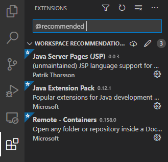
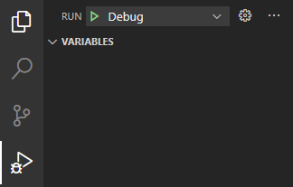
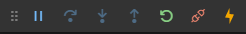

Apache + Tomcat + VS Code
================================================================================

VS Code で Servlet のデバッグをするサンプルです。

使い方
================================================================================

必要な物
--------------------------------------------------------------------------------

* Visual Studio Code
* Docker Desktop

VS Code で開く
--------------------------------------------------------------------------------

VS Code でこのフォルダを開きます。

拡張のインストール
--------------------------------------------------------------------------------

拡張機能をインストールします。

Remote Containers で開く
--------------------------------------------------------------------------------

Ctrl + Shift + P を押し、「Remote-Containers: Reopen in Container」を検索して選択します。

デバッグを開始する
--------------------------------------------------------------------------------

デバッグを開始します。

初期設定だと [http://localhost:10080/](http://localhost:10080/) で動作確認できます。

ソースを修正した場合
--------------------------------------------------------------------------------

デバッグパネルの Restart または Hot Code Replace をクリックすると反映されます。

